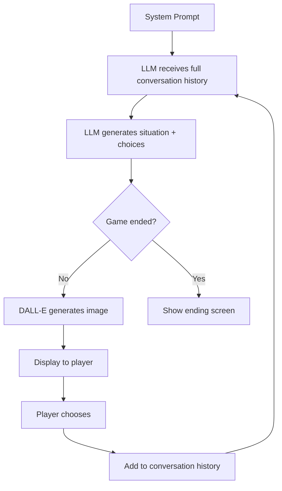

# Hormuz - Generic LLM-Driven Game Engine 🎮

A fully generic, AI-powered interactive narrative game engine. Play geopolitical crises, fantasy adventures, or any scenario by simply swapping the system prompt.

## 🎯 Current Game: Nuclear Crisis Simulation

Navigate an Iranian nuclear crisis as U.S. President. Every decision matters. Multiple endings possible.

## ✨ Key Features

### 🤖 Fully Generic Game Engine
- **Any Scenario Works**: Change the system prompt to play completely different games
- **100% AI-Generated**: Claude creates situations, choices, and determines endings
- **Complete Continuity**: LLM sees full conversation history for coherent storytelling
- **Dynamic Endings**: AI decides when and how the game ends based on victory/defeat conditions
- **No Hardcoded Content**: Every playthrough is unique

### 🎨 Visual Experience
- **AI-Generated Art**: DALL-E 3 creates unique comic book-style images for each turn
- **Dramatic Atmosphere**: Dark, moody graphic novel aesthetic (Batman: Dark Knight Returns style)
- **Console Logging**: Image URLs logged to console for debugging

### 🎲 Gameplay
- **15 Turn Campaign**: Navigate complex crises from start to finish
- **4-6 Meaningful Choices**: Each decision has realistic consequences
- **Multiple Endings**: Victory, defeat, stalemate, pyrrhic victory, or disaster
- **Custom Actions**: Type free-form commands (optional feature)

## 🚀 Quick Start

```bash
# Install dependencies
npm install

# Set up environment variables
cp .env.example .env.local

# Add your API keys to .env.local:
ANTHROPIC_API_KEY=sk-ant-...        # For game narrative & choices
OPENAI_API_KEY=sk-proj-...          # For image generation

# Optional features
NEXT_PUBLIC_ENABLE_CUSTOM_ACTIONS=true
NEXT_PUBLIC_MAX_CUSTOM_ACTIONS=3

# Run development server
npm run dev

# Open http://localhost:3000
```

## 📖 Documentation

- **[Generic Game Engine](./docs/GENERIC_GAME_ENGINE.md)** - ⭐ How the system works
- **[Game Design](./docs/GAME_DESIGN.md)** - Original design doc
- **[Technical Architecture](./docs/TECHNICAL_ARCHITECTURE.md)** - Tech stack details

## 🏗️ How It Works



### Turn Flow

1. **System Prompt** defines the scenario, rules, and victory conditions
2. **LLM receives** full conversation history (all previous situations + player choices)
3. **LLM generates**:
   - Detailed situation description (300-500 words)
   - 4-6 meaningful choices
   - Game status (continue or ended)
   - If ended: victory/defeat type and final narrative
4. **Image generated** by DALL-E based on situation
5. **Player sees** image, situation, and choices
6. **Player chooses** an option
7. **Choice added** to conversation history
8. **Repeat** until LLM determines game has ended

### Conversation History

The LLM sees everything:
```json
[
  {
    "turnNumber": 1,
    "situation": "Intelligence confirms Iran is weeks from nuclear capability...",
    "playerChoice": "Pursue Diplomatic Solution"
  },
  {
    "turnNumber": 2,
    "situation": "Your diplomatic outreach has opened a backchannel...",
    "playerChoice": "Authorize CIA Assessment"
  }
]
```

This ensures perfect narrative continuity.

## 🎯 Creating New Scenarios

It's incredibly simple! Create a file in `/lib/scenarios/`:

```typescript
// lib/scenarios/medieval.ts
export const MEDIEVAL_SCENARIO: GameScenario = {
  id: 'medieval',
  name: 'Crown & Castle',
  description: 'Manage a medieval kingdom in turmoil',
  maxTurns: 20,
  imageStyle: 'Medieval fantasy art, Game of Thrones aesthetic',

  systemPrompt: `
    You are the Game Master for "Crown & Castle".

    SCENARIO:
    You are a young monarch. Your father just died. The realm is in turmoil.
    Rival nobles plot against you. Neighbors threaten invasion. The treasury
    is empty. Can you survive and prosper?

    VICTORY CONDITIONS:
    - Kingdom stable after 20 turns
    - Treasury positive
    - Nobles loyal or subdued
    - People content

    DEFEAT CONDITIONS:
    - Overthrown by nobles
    - Kingdom conquered
    - Peasant revolt succeeds

    [Full system prompt with JSON response format...]
  `,
};
```

That's it! The engine handles everything else automatically.

## 🛠️ Tech Stack

- **Next.js 15** - React framework with App Router
- **TypeScript** - Type safety
- **Tailwind CSS** - Styling
- **Zustand** - State management
- **Claude 3.5 Sonnet** - Game generation (via Anthropic API)
- **DALL-E 3** - Image generation (via OpenAI API)
- **Framer Motion** - Animations

## 📂 Project Structure

```
hormuz/
├── app/
│   ├── api/
│   │   ├── generate-image/        # Server-side DALL-E
│   │   └── process-custom-action/ # Server-side Claude
│   ├── game/                       # Main game page
│   └── page.tsx                    # Landing page
├── lib/
│   ├── scenarios/
│   │   ├── hormuz.ts              # Hormuz scenario config
│   │   └── types.ts               # Scenario types
│   ├── game-engine/
│   │   ├── generic-turn-generator.ts      # Core LLM interaction
│   │   ├── generic-turn-processor.ts      # Process choices
│   │   └── image-generator.ts             # Image generation
│   └── data/turns/
│       └── index.ts               # getTurnData()
├── stores/
│   └── game-store.ts              # Zustand state
├── types/
│   ├── game.ts                    # Game state types
│   └── turn.ts                    # Turn types
├── components/
│   ├── game/                      # Game UI components
│   └── shared/                    # Reusable components
└── docs/                          # Documentation
```

## 🎨 Example Scenarios

The engine supports any genre:

| Genre | Example | Description |
|-------|---------|-------------|
| 🌍 **Geopolitical** | Hormuz (current) | Navigate nuclear crises, diplomatic negotiations |
| ⚔️ **Fantasy** | Crown & Castle | Manage kingdoms, handle nobles and invasions |
| 🚀 **Sci-Fi** | Station Zero | Space station disasters, alien first contact |
| 🔍 **Mystery** | Detective Noir | Murder investigations, gather clues |
| 🧟 **Horror** | Dead Rising | Zombie outbreak survival, tough choices |
| 💼 **Business** | Startup CEO | Build a company, handle investors |
| 📚 **Historical** | 1776 | American Revolution, wartime leadership |

## 🔑 Environment Variables

```env
# Required
ANTHROPIC_API_KEY=sk-ant-...        # Claude API for game generation
OPENAI_API_KEY=sk-proj-...          # DALL-E for images

# Optional Features
NEXT_PUBLIC_ENABLE_CUSTOM_ACTIONS=true    # Allow free-form text input
NEXT_PUBLIC_MAX_CUSTOM_ACTIONS=3          # Limit custom actions per game
```

## 🎯 Game Flow Example

**Turn 1**: Opening crisis
```
Situation: "Intelligence confirms Iran is weeks from nuclear capability..."
Choices:
  A) Pursue diplomatic solution
  B) Increase military pressure
  C) Order CIA assessment
  D) Call Israeli PM privately
```

**Player chooses A**

**Turn 2**: Consequences shown
```
Situation: "Your diplomatic outreach has opened a backchannel. Iranian
           Foreign Minister signals willingness to talk, but hardliners
           are skeptical. Israel grows impatient..."
Choices:
  A) Push for direct talks
  B) Coordinate with allies first
  C) Authorize cyber operation
  D) Maintain current course
```

...continues until victory/defeat

## 🌟 Why This Matters

### Traditional Narrative Games
- ❌ Hardcode every scenario
- ❌ Limited branching
- ❌ Expensive content creation
- ❌ Can't adapt to new stories

### This Engine
- ✅ Generates infinite variety
- ✅ Perfect narrative coherence
- ✅ Works for any genre
- ✅ Unique every playthrough
- ✅ Just write a system prompt!

## 🔮 Future Enhancements

- [ ] Multiple scenario selection on main menu
- [ ] Community-created scenarios (share system prompts)
- [ ] Difficulty settings (adjust LLM temperature/creativity)
- [ ] Save/load at any turn
- [ ] Multiplayer mode (multiple advisors vote)
- [ ] Voice narration
- [ ] Background music and sound effects
- [ ] Statistics and analytics dashboard

## 🧪 Testing

```bash
# Build
npm run build

# Lint
npm run lint

# Type check
npx tsc --noEmit
```

## 📝 Scripts

```bash
npm run dev      # Start development server (port 3000)
npm run build    # Build for production
npm run start    # Start production server
npm run lint     # Run ESLint
```

## 🐛 Debugging

Images logged to console:
```javascript
[Image Generator] ✅ Image generated successfully!
[Image Generator] URL: https://oaidalleapiprodscus.blob.core.windows.net/...
[SceneImage] Displaying AI-generated image: https://...
```

Turn generation logged:
```javascript
[Generic Turn Generator] Generating turn 3 for scenario: hormuz
[Generic Turn Generator] Sending 5 messages to LLM
[Generic Turn Generator] Received response (2847 chars)
[Generic Turn Generator] Turn generated: { situationLength: 423, choicesCount: 4, gameStatus: 'continue' }
```

## 📄 License

MIT

## 🤝 Contributing

This is an experimental project demonstrating LLM-driven interactive narratives.

To add a new scenario:
1. Create `/lib/scenarios/your-scenario.ts`
2. Define system prompt with victory/defeat conditions
3. Specify image style for DALL-E
4. Add to scenario registry
5. Play!

## 🙏 Acknowledgments

- **Anthropic** for Claude API
- **OpenAI** for DALL-E 3
- **Next.js team** for the amazing framework
- **Vercel** for deployment platform

---

**Version**: 2.0 - Generic Engine
**Status**: ✅ Fully Functional
**Last Updated**: March 2026

**Ready to navigate the crisis?** 🌍
